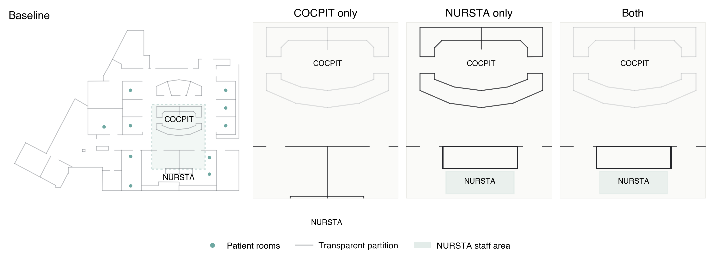

# Spatially Explicit ED Interaction Model

A workflow-constrained agent-based model of face-to-face interaction in a
bounded emergency-department care area. The model separates physical routing
geometry from visibility geometry, allowing spatial interventions to alter
intervisibility without changing walls, movement, or clinical workflow.



## Study Status

| Part | Status | Scope |
|---|---|---|
| Part 1 | Completed and frozen | Validation of the non-LLM embodied interaction engine against empirical shadowing data (`n=100`). |
| Part 2 | Completed and frozen | Paired comparison of four spatial conditions in two scenarios (`800` runs), plus a two-phase four-factor sensitivity screen. |
| Part 3 causal study | Completed | Five balanced cognitive orientations crossed with role, condition, and scenario (`400` closed-loop runs); technical and design gates passed. |
| Part 3 appraisal study | In progress | All-seed paired packet construction and analysis are prepared; CPU preflight and GPU appraisal inference remain pending. |

Part 1 produced 22.14 simulated F2F interactions per hour against an empirical
target of 22.78, with 100/100 workflow PASS and clean hard gates. Part 2
completed 800/800 workflow-clean runs. The Part 3 closed-loop study completed
400/400 runs with balanced persona exposure, isolated exogenous arrival
streams, temporal and sampling coverage, and clean technical integrity gates.

## Scientific Boundary

The rule-based ABM owns geometry, routing, workflow, patient flow, ESI logic,
feasible partners, proximity, and interaction logging. Parts 1 and 2 never use
an LLM. Part 3 is opt-in: Qwen may choose among ABM-supplied feasible
discretionary interaction actions, but it cannot invent movement, patients,
partners, or events. Synthetic appraisals are design probes, not staff
testimony or psychometric measurements.

## Repository Layout

```text
src/          model, agents, geometry, interaction, and Part 3 policy code
scripts/      reproducible run, verification, analysis, and figure entrypoints
jobs/         Snellius batch definitions
manifests/    active paired experiment manifests and source lock
data/         non-participant geometry inputs
docs/         architecture, protocols, study plans, and literature map
outputs/
  findings/  publication-ready aggregate figures and tables
```

Raw participant-linked data, imported n100 run trees, model caches, cluster
logs, archives, and generated Part 3 traces are intentionally excluded from
version control.

## Installation

Parts 1 and 2 use a CPU environment:

```bash
python3 -m venv .venv
source .venv/bin/activate
python3 -m pip install -r requirements.txt
```

The vLLM backend must be installed in a separate GPU environment:

```bash
python3 -m venv vllm-env
source vllm-env/bin/activate
python3 -m pip install -r requirements-llm.txt
```

See [Part 3 LLM backend setup](docs/PART3_LLM_BACKEND_SETUP.md) for the
Snellius workflow. Do not mix the two environments.

## Verification

Syntax and batch-file checks do not require research data:

```bash
python3 -m py_compile config.py main.py src/*.py scripts/*.py
find jobs -maxdepth 1 -name '*.sbatch' -print -exec bash -n {} \;
```

The full model verification command requires the restricted empirical
shadowing source at the path documented in `config.py`:

```bash
python3 main.py --verify
```

Completed n100 batches should not be rerun for ordinary development.

## Results and Documentation

- [Part 1 validation report](outputs/findings/part1_validation_n100/part1_validation_n100_report.md)
- [Part 2 intervention figures and tables](outputs/findings/part2_spatial_interventions_n100/)
- [Part 2 sensitivity figures and tables](outputs/findings/part2_parameter_sensitivity_n20/)
- [Architecture](docs/ARCHITECTURE.md)
- [Experiment status](docs/EXPERIMENT_PLAN.md)
- [Part 3 protocol](docs/PART3_PLAN.md)
- [Literature map](docs/LITERATURE_REFERENCE_MAP.md)

## Data Availability

The repository contains geometry inputs and aggregate reported findings. The
participant-linked shadowing source and full run-level outputs are not public
repository assets. A deidentified archival data package and software citation
will be prepared with the final paper release.

## Interpretation Limits

Do not infer clinical outcomes, universal ED design recommendations, human
experience, validated personality types, or transfer to other layouts without
recalibration. The Part 3 personas are preregistered synthetic workplace
orientations; their OCEAN display is illustrative and never a causal input.
