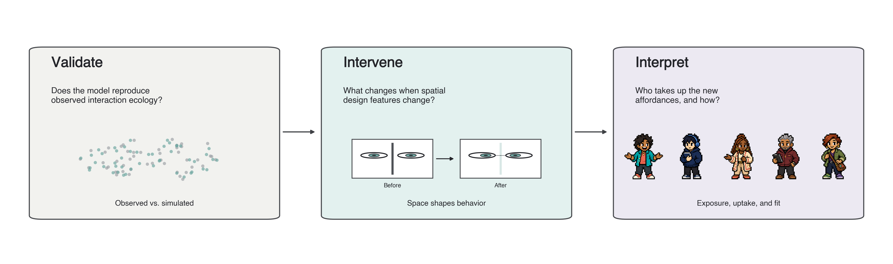

# Spatially Explicit ED Interaction Model

A workflow-constrained, spatially embodied agent-based model of face-to-face
interaction in an emergency department. The study compares the model with
empirical shadowing data, tests visibility and workstation interventions, and
examines how five designed personas take up the resulting spatial affordances.



## Study at a Glance

| Part | Question | Design |
|---|---|---|
| 1. Compare | Which observed interaction patterns does the baseline reproduce? | Empirical comparison and spatial negative controls across `100` runs |
| 2. Intervene | What changes when spatial design features change? | Four spatial conditions, two operating scenarios, `800` paired runs, and a four-factor sensitivity screen |
| 3. Interpret | Who takes up the new affordances, and how? | Five personas balanced across role, condition, scenario, and assignment round in `400` runs, followed by synthetic appraisals and an accumulated-experience check |

Part 1 recovered the broad observed hotspot structure, although its matched
focal interaction rate was lower than the observed rate (`5.92` versus `29.04`
events per focal-person-hour). Part 2 completed `800/800` workflow-clean,
paired runs. Part 3 completed `400/400` balanced runs; the five personas had
similar gains in colleague visibility but differed in additional
persona-initiated contact, decisions under identical situations, and
post-shift appraisals. In a preliminary bridge to
observed staff experience, six comparable normal-load synthetic questionnaire
means differed from the observed means by `0.23` scale points on average;
their full response distributions did not meet the prespecified convergence gate.

## Model Boundary

The rule-based ABM owns geometry, routing, workflow, patient flow, acuity,
feasible partners, proximity, mutual visibility, and event logging. Parts 1
and 2 never use an LLM. Part 3 is opt-in: Qwen may choose among feasible
discretionary interaction actions supplied by the ABM, but it cannot invent
movement, patients, partners, or events.

The five Part 3 personas are predefined synthetic workplace profiles,
not discovered or validated personality types. Their OCEAN profiles are
illustrative display labels and are never causal model inputs. Synthetic
appraisals are design probes, not testimony from Zurich ED staff.

## Repository Map

```text
src/          model, geometry, interaction, metrics, and Part 3 policy code
scripts/
  run/        simulation and inference entry points
  validation/ preflight and result-verification commands
  analysis/   scientific post-processing
  build/      manifests, packets, figures, tables, and web-data builders
jobs/         Snellius execution and preflight definitions
manifests/    paired experiment manifests and source-integrity lock
data/         non-participant geometry inputs
docs/         architecture, completed-study protocols, and analysis plans
tests/        compact study-contract and publication-artifact regression suite
outputs/
  findings/   publication-ready aggregate figures and machine-readable tables
web/
  persona-explorer/  interactive Part 3 results interface
```

Participant-linked data, imported run trees, model caches, cluster logs,
archives, and generated traces are intentionally excluded from version
control.

## Installation

Parts 1 and 2 use the CPU environment:

```bash
python3 -m venv .venv
source .venv/bin/activate
python3 -m pip install -r requirements.txt
```

The Part 3 vLLM backend requires a separate GPU environment:

```bash
python3 -m venv vllm-env
source vllm-env/bin/activate
python3 -m pip install -r requirements-llm.txt
```

See the [Part 3 backend setup](docs/PART3_LLM_BACKEND_SETUP.md) for the
reproducible Snellius workflow. The CPU and vLLM environments should not be
mixed.

## Five-minute quick start

From the repository root, after installing the CPU requirements, run a short
baseline simulation:

```bash
python3 scripts/run/run_single.py \
  --scenario-mode normal_load --condition baseline --seed 1 \
  --duration 600 --warmup-seconds 0 --output-dir outputs/quickstart
```

Open `outputs/quickstart/summary.json` for the run settings and outcome
summary, or `outputs/quickstart/interaction_events.csv` for logged contacts.
The output directory is ignored by Git. This ten-minute *simulation* is a
software smoke test, not a reproduction of the paper's 12-hour runs with a
two-hour warm-up and ten-hour analysis window. It requires no restricted
shadowing data or GPU.

## Verification

Repository-level checks do not require restricted research data:

```bash
python3 -m py_compile \
  config.py main.py src/*.py scripts/*/*.py tests/*.py
python3 -m unittest discover -s tests -p 'test_*.py' -v
find jobs -maxdepth 1 -name '*.sbatch' -print -exec bash -n {} \;
```

Result-level verification commands live in `scripts/validation/` and require
the corresponding restricted source data or completed run tree. The completed
Part 1, Part 2, and Part 3 batches should not be rerun for ordinary
development.

## Results

- [Results index: what each public figure and table represents](docs/RESULTS_INDEX.md)
- [Study overview and interaction pipeline](outputs/findings/study_overview/)
- [Part 1 baseline-resemblance findings](outputs/findings/part1_validation_n100/)
- [Part 2 intervention findings](outputs/findings/part2_spatial_interventions_n100/)
- [Part 2 sensitivity findings](outputs/findings/part2_parameter_sensitivity_n20/)
- [Part 3 persona findings](outputs/findings/part3_cognitive_personas_n10/)
- [Part 3 questionnaire-convergence table](outputs/findings/part3_cognitive_personas_n10/tables/tableD_questionnaire_convergence.csv)
- [Interactive persona explorer](https://arisaanto.github.io/ed-abm/)
- [Persona explorer source](web/persona-explorer/)

Figures are retained as publication-ready PDF and review-friendly PNG files.
Aggregate tables are retained once as machine-readable CSV files; the
manuscript owns its typeset table copies.

## Documentation

- [Architecture](docs/ARCHITECTURE.md)
- [Part 2 intervention protocol](docs/PART2_SPATIAL_INTERVENTIONS_PROTOCOL.md)
- [Part 3 appraisal protocol](docs/PART3_APPRAISAL_ANALYSIS_PROTOCOL.md)
- [Part 3 GPU backend setup](docs/PART3_LLM_BACKEND_SETUP.md)

[The earlier Part 3 development plan](docs/PART3_PLAN.md) is preserved as
history. Its abandoned factorial ablation is not a result in the current
paper; use the results index and final outputs for reported findings.

## Data Availability

This repository contains software, non-participant geometry inputs, aggregate
reported findings, and the interactive results interface. The
participant-linked shadowing source and full run-level outputs are not public
repository assets. Any future release of deidentified source data remains
subject to the source study's approval and data-management conditions.

## Interpretation Limits

The results do not establish clinical outcomes, a universally optimal ED
layout, real staff experience, validated personality types, or transfer to
other sites without recalibration. Part 3 estimates responses within this
model and its predefined personas.

## Citation

The manuscript is in preparation. Until a formal citation is available, cite
this repository by its title, author, URL, and archived release or commit.

## License

The software is released under the [MIT License](LICENSE). Data and third-party
assets remain subject to their original access and licensing terms.
